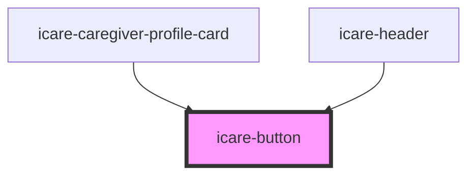

# icare-button

<!-- Auto Generated Below -->

## Properties

| Property  | Attribute | Description | Type                             | Default     |
| --------- | --------- | ----------- | -------------------------------- | ----------- |
| `label`   | `label`   |             | `string`                         | `'Click'`   |
| `size`    | `size`    |             | `"large" \| "medium" \| "small"` | `'medium'`  |
| `variant` | `variant` |             | `"primary" \| "secondary"`       | `'primary'` |

## Dependencies

### Used by

 - [icare-caregiver-profile-card](../icare-caregiver-profile-card)
 - [icare-header](../icare-header)

### Graph

----------------------------------------------

*Built with [StencilJS](https://stenciljs.com/)*
