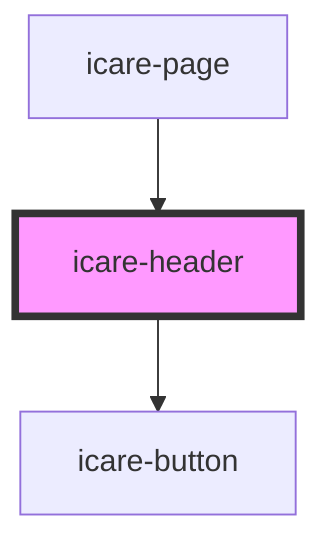

# icare-header

<!-- Auto Generated Below -->

## Properties

| Property   | Attribute   | Description | Type      | Default |
| ---------- | ----------- | ----------- | --------- | ------- |
| `loggedIn` | `logged-in` |             | `boolean` | `false` |

## Dependencies

### Used by

 - [icare-page](../icare-page)

### Depends on

- [icare-button](../icare-button)

### Graph

----------------------------------------------

*Built with [StencilJS](https://stenciljs.com/)*
